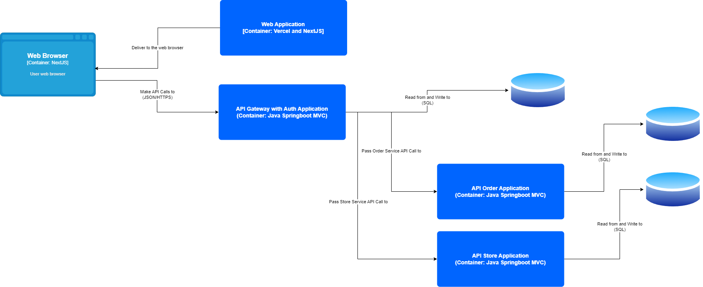

## Current Architecture
### Deployment Diagram

### Context Diagram

### Container Diagram

## Future Container Diagram

## Risk Analysis
- Database Unavailable
    - Skenario: Aplikasi sudah sukses dan memutuskan untuk hosting dengan membuat database fisik sendiri
    - Analysis
        - Database dapat menjadi unavailable pada waktu yang tiba-tiba dan menyebabkan frontend tidak dapat fetch data dari database
        - Tetapi, karena tidak semua fitur tergabung ke dalam satu database, maka walaupun 1 database mengalami error, maka tidak semua fitur akan terdampak
        - Kecuali, semua database mengalami down, maka website tidak dapat melakukan fetch data apapun sehingga akan menjadi high risk
        - Untuk kasus umum cenderung likely to occur dan have medium impact
    - Storming
        - Setelah mengidentifikasi permasalahan tersebut, kami akan melakukan mitigasi dengan cara mengimplementasikan RAID untuk physical database sehingga jika terjadi kegagalan pada satu blok data, maka blok data yang menjadi backup masih dapat membuat database aktif dan tidak unavailable secara sepenuhnya. Namun, disini ada satu kekurangan di mana dari sisi ongkos akan lebih mahal karena membutuhkan physical database yang lebih banyak sebagai database tersebut. Tetapi, jika mempertimbangkan dari sisi performance dan keamanan, kami memutuskan bahwa akan tetap mengimplementasikan RAID.

- Potential Database Vulnerability
    - Skenario: Aplikasi sudah membutuhkan query database yang kompleks sehingga menggunakan query manual untuk Jpa
    - Analysis
        - SQL Injection mungkin jarang terjadi, tetapi jika sekali terjadi, maka sangat berbahaya untuk database karena dapat menyebabkan perubahan nilai data-data yang tersimpan, atau parahnya lagi dapat menghapus tabel-tabel yang penting
        - Dapat melalui raw query (variabel sebagai parameter) yang tidak disanitasi terlebih dahulu
        - Cenderung not likely to occur but extremely dangerous
    - Storming
        - Setelah mengidentifikasi masalah tersebut, kami memutuskan untuk membuat fungsi untuk sanitasi data secara manual sehingga input yang masuk nanti dapat menjadi lebih ketat dan tidak boleh mengandung spesial karakter yang berbahaya dan bersifat mengancam. Sanitasi akan dilakukan dari sisi backend saja dibandingkan frontend untuk lebih menghemat waktu dan lebih efisien, karena melakukan sanitasi di frontend masih dapat dibypass dengan menggunakan proxy seperti burpsuite
    